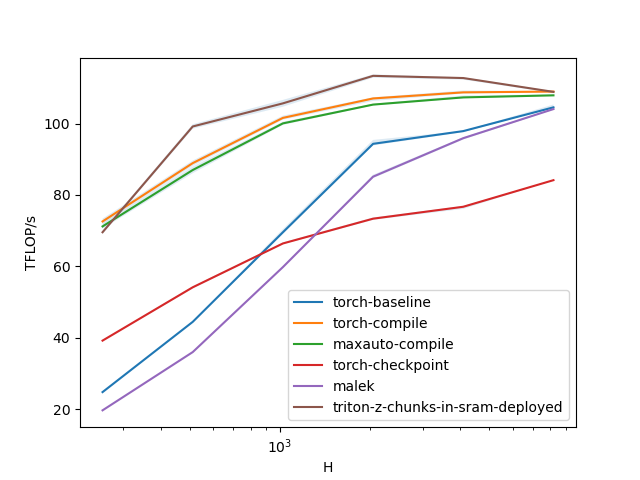
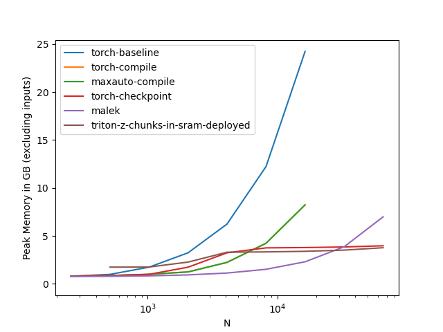
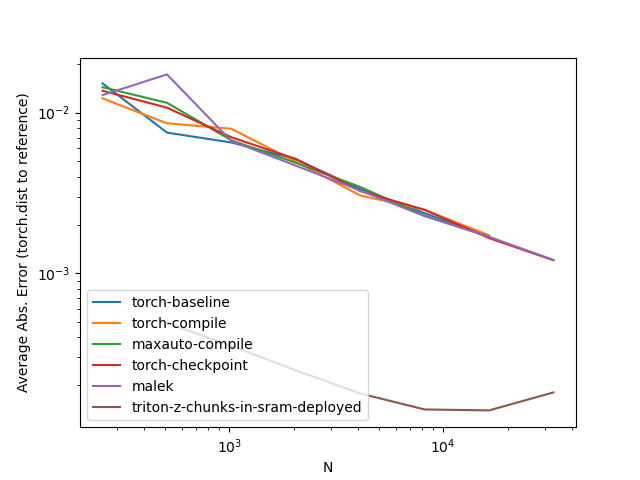

# LinearCrossEntropyLoss

This is a fused implementation that combines `torch.nn.Linear` layer and `torch.nn.CrossEntropLoss` into a single module.
This kind of fused implementation can save a lot of activation memory, especially in usecases in language modeling where sequence lengths or batch sizes are long
and vocabulary sizes are massive. Compared to a baseline implementation, which may materialize 2-3 tensors of size `batch_size x seq_length x vocabulary_size x 4`, this module will only materialize a single tensor of size
```N_chunk_size x vocabulary_size x 4``` bytes at its peak. `N_chunk_size` is a user-controlled variable.

As an additional benefit, the implementation is a bit more careful about floating point operations and, in my tests, noticeably more accurate 
than the baseline, without being slower (see benchmarks shown below and in the `bench` folders).

This solution owes a lot to the implementation of `mgmalek`, which is posted here: https://github.com/mgmalek/efficient_cross_entropy.
You can think of this implementation as a more feature-complete version of the same chunking strategy, with gains through additional fusions
of everything else into matrix multiplications prologues/epilogues, and some changes to preserve accuracy. The whole thing was written after reading 
https://github.com/pytorch/pytorch/issues/124480, which contains a lot of interesting input from `YouJiacheng` and from the PyTorch team. 
I somewhat assume that this kind of performance optimization will eventually be entirely subsumed by improvements to `torch.compile`.


# Usage 
    >>> from linear_cross_entropy import LinearCrossEntropyLoss
    >>> module = LinearCrossEntropyLoss(4096, 16384)
    >>> x = torch.randn(4, 512, 4096, device=torch.device("cuda"))
    >>> y = torch.randn(4, 512, device=torch.device("cuda"), dtype=torch.long)
    >>> loss = module(x, y)


LinearCrossEntropyLoss applies a linear transformation to the incoming data `z = xA^T` and then immediately
        computes the cross entropy loss of z with a tensor of labels y `L(z, y)`, and returns this loss as a scalar value.

### Caveats:
* All dimensions need to be divisible by sufficiently large powers of 2
* Monitoring is optional and turned off by default.
* Speed-ups over a compiled torch baseline only materialize in float 16 with sufficiently large vocabulary sizes / numbers of classes
    or very long sequences or batch sizes.
* This module is an instance of `nn.Linear` to pick up initialization calls to `nn.Linear`, but the weight matrix is transposed
    compared to normal `nn.Linear` layers.
* This function will call a (substantial) triton autotune list the first time it is called. You can reduce or change the number of evaluated
    configs by modifying `linear_cross_entropy.fwd_configs` and `linear_cross_entropy.bwd_configs`.
* Be careful when auto-casting this module. Right now, the code default to auto-casting to `float16`. This might not be what you need.
* If you want to use this module for *inference*, you should re-enable checks so that the backward function only triggers if `weight.requires_grad` is `True`. (I didn't do this by default because it is incompatible with `autocast`.)

### Monitoring:
Setting `LinearCrossEntropyLoss(4096, 16384).monitoring = True` will additionally accumulate a number of monitoring
variables as a dictionary in  `module.metrics`. These are
* Logit Norm
* Maximal logit value
* Logit Entropy
* z-regularization value.


### Args:
* `in_features`: hidden size of each input sample
* `out_features`: size of each output sample (this will be vocabulary size / number of classes)
* `ignore_index`: Which label index to ignore (as in normal CrossEntropyLoss) [Default: -1]
* `logit_scale`: Whether to scale the logits before the loss computations [Default: 1.0]
* `z_regularization`: Whether to include z regularization (minimizing logsumexp(x)) [Default: 0.0]
* `N_chunk_size`: How fine to chunk the leading dimensions. The peak memory load will be N_chunk_size x out_features x 4 bytes [Default 4096]
* `init_method`: This is an optional callable initialization function [Default: None]

### Shape:
- Input `x` (input embeddings): :math:`(*, H_{in})` where :math:`*` means any number of
    dimensions including none and :math:`H_{in} = \text{in\_features}`.
- Input `y` (labels): :math:`(*)` This should be a `torch.long` tensor with the same number of elements,`(*)`,
    as the input embeeddings.
- Output: :math:`(1,)` This function always returns the fully reduced loss.

### Attributes:
- `weight`: the learnable weights of the module of shape
    :math:`(\text{in\_features}, \text{out\_features})`. The values are
    initialized from :math:`\mathcal{N}_text{trunc}(1/ \sqrt{k})`, where
    :math:`k = \frac{1}{\text{in\_features}}`

### Functional Form

You can also directly use the functional version as `linear_cross_entropy(x,y)`


# Benchmark Results

There are a ton of benchmarks of speed (in `bench`), memory (in `bench-mem`) and accuracy (in `bench-acc`). Take a look!
The benchmarking script is `bench_fusions.py`.







For reference, the benchmarked version of `torch.compile` is the nightly from the 15th of July, 2024.

# Final Notes

This solution of "z/logit chunks in SRAM" is still quite unsatisfying to me. I would prefered not to ever materialize the logits in
main memory, but have so far failed to find a scalable solution to that end. You can find a graveyard of bad alternatives in the `variants`
folder. The problem that I've run into is that the hidden dimensions I care about are to large to keep large chunks cached, leading to 
extensive traffic from and to the cache that kills performance.
